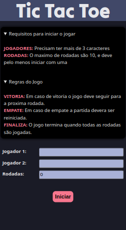
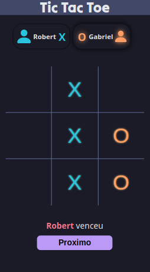

# Projeto Tic Tac Toe

## Resumo
Conhecido tambem como Jogo da Velha, esse projeto pessoal é uma aplicação simples que buscar trazer diverção para aqueles que gostam de um passatempo.

<br>

## Sumário
[Explicação](#explicação)

[Tecnologias e Ferramentas](#tecnologias-e-ferramentas)

[Instalação](#instalação)

<br>

## Explicação

<details>
  <summary>Desktop</summary>
  <div align="center">
    
    
  </div>
</details>

<details>
  <summary>Mobile</summary>

  <div align="center">
    
    
    
  </div>
</details>

<br>

O projeto <strong>Tic Tac Toe</strong>. Foi criado, com objetivo de colocar em pratica diversos conhecimentos em _FrontEnd_ através da biblioteca ***REACT***, ***CSS puro***, ***Responsividade*** e outras dependencias usando ***NPM***.

A aplicação inicia na rota `/`, onde sera mostrado um botão escrito `Começar` que ao ser clicado sera disponibilizado um pequeno formulario que devera ser preenchido com os seguintes dados:

- Nome do 1° jogador(a)
- Nome do 2° jogador(a)
- Numero de rodadas que ambos vão jogar(o limite de Rodadas são 10)

Ao finalizar essa etapa, o usúario podera seguir clicando no botão de `Iniciar`. E assim ter acesso ao jogo que acontecera em multiplayer. Porem esse jogo possui algumas regras:

- Em caso de empate a partida tera de ser **Reiniciada**
- Em caso de vitória podera prosseguir para a **Proxima** rodada.

Assim que todas as rodadas forem feitas, o usuario deverar retornar para a rota `/`, onde poderá solicitar outra partida.

**OBS**: Esta aplicação utiliza Testes de integração.

<br>

## Tecnologias e Ferramentas
Durante o desenvolvimento, essas foram as tecnologias, metodos e ferramentas usadas:

- ContextApi
- CSS
- Javascript
- POO
- React funcional
- React Hooks
- React Router Dom
- RTL/Jest (Testes de integração)
- VS Code

<br>

## Instalação

```bash
# Abra um terminal e copie este repositório com o comando
git clone git@github.com:RobertSantos-dev/Tic-Tac-Toe.git

# Entre na pasta
cd Tic Tac Toe/

# Rode um destes comandos para instalar as dependências
yarn install
ou 
npm install

# Rode este comando para executar a aplicação
npm run dev

# Copie o endereço de localhost do terminal e cole na navegador.
```
